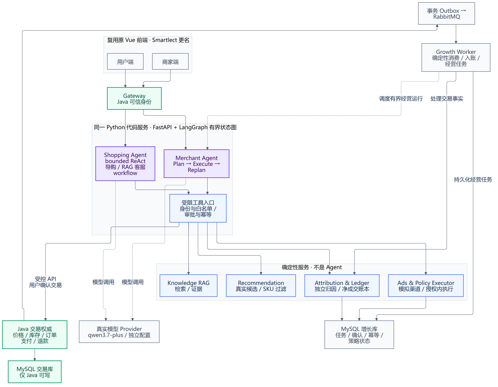

# Smartlect

[](https://github.com/LittleSongxx/Smartlect/actions/workflows/ci.yml)

单店 AI 导购、RAG 客服与模拟经营闭环：**Java 微服务电商底座 + Python Agent 增长层 + 双前端**，已部署到阿里云生产环境三机集群运行。

**在线演示**：用户端 `http://39.107.102.244/` ｜ 管理端 `http://39.107.102.244/admin/`（域名 + HTTPS 等 ICP 备案通过后切换）

## 生产级能力（全部有实测证据）

部署形态：三机常驻集群——node1（8c32g）承载 9 个 Spring Cloud 服务 + Python Growth（API/worker）+ 2 前端 + MySQL + 监控栈，node2/3（2c8g×2）承载 RabbitMQ quorum/Nacos Raft/Redis 副本与哨兵；中间件全集群态、systemd 全链自启。生产化工程落在以下十项，每项都有命令、输出与截图留档（`docs/prod-hardening/`）：

| 能力 | 关键数字 |
|---|---|
| [监控告警](docs/prod-hardening/monitoring.md) | 15 个采集目标、10 条告警规则、邮件闭环（docker pause 注入→收到告警→自动恢复全程实测） |
| [备份与 PITR](docs/prod-hardening/backup-restore-drill.md) | 恢复演练在相隔 12 秒的两个写入间精确切割，11 库金额 checksum 全对齐，RTO≈30s |
| [CI/CD](docs/prod-hardening/cicd.md) | 测试流水线 + 一键部署/回滚；deploy key 锁死为四动词网关拿不到 shell |
| [压测与优化](docs/prod-hardening/loadtest-report.md) | 四场景基线；去掉生产链路里的开发态代理后 **p95 127→51ms（-60%）**、CPU 负载 -43% |
| [全链路追踪](docs/prod-hardening/tracing.md) | OTel 全栈 10 服务入图；3.1s 对话 trace 一眼定位 **2.5s 花在 LLM 出站**而非应用链路 |
| [对账自动化](docs/prod-hardening/recon-deadletter.md) | Java 支付权威 vs 事件账本每日对账；1 分钱注入演练 25 秒闭环 |
| [LLM 成本/质量看板](docs/prod-hardening/llm-dashboard.md) | 零业务代码改动聚合模型调用画像；上线即暴露转人工率 61.5% 真实信号，成本 ¥0.85/88 次调用 |
| [HA 演练](docs/prod-hardening/ha-design.md) | 四组件真实 kill：自愈 10-43s、Seata 宕机下单 1.6s 快速失败无半提交；抓出「整库宕机不告警」盲区并修复 |
| [跨机集群](docs/prod-hardening/ha-cluster.md) | 3 台 ECS 常驻集群（RMQ 3 节点 quorum/Redis 哨兵/Nacos Raft），leader 击杀 11s 重选举、**2430 发=2430 收零丢失**、sentinel 1.06s 切主；node1 升配 8c32g 后同场景 **400 VU QPS 109→349（+220%）、p95 8.64s→40ms**；Micrometer 取证揪出 Hikari 池(4)假墙，一行 env 调到 12 后**真极限 ~815 req/s（node1 CPU 90% 打满）**，生产限流定格 400；并揪出 Jaeger 无上界内存（19.4GB OOM 致宿主假死）完成加固 |

## 架构与边界

Java 是价格、库存、订单、支付和退款的**唯一权威**；Python Growth 通过受控 API 与业务事件接入，不直改交易表。用户确认具体交易后才落单；商家首次批准稳定授权范围，后续经营计划在范围内执行，越界重新批准。

- **Java 电商底座**：价格、库存、订单、支付、退款与归因在交易侧落库；幂等与金额以 Java 为准。
- **Python Growth**：两个领域 Agent——Shopping 是有界 ReAct，Merchant 是观察→计划→授权内执行→等待新观测后再规划。没有总 Supervisor，也没有意图分类器把控制权交给模型。
- **确定性服务**：推荐、RAG 检索、投放保护、归因和确认执行不额外包装成 Agent。只读 MCP 复用同一套工具与权限，不暴露写工具。
- **两端界面**：用户端是商城首页、浏览、导购/客服、商品与订单；管理端是活动授权、经营助手、知识库与人工客服。刷新不重放写操作。终答与经营 run 附带只读决策快照。



支付与广告费用均为本地模拟，没有接入真实资金或对外投放。

## 本地运行

需要 JDK 17+、Maven、Python 3.11+、Node/npm 和 Docker Compose。默认 loopback 端口避让其他项目：用户端 `18180`，管理端 `18181/admin/`，网关以 `./scripts/dev.sh status` 为准。

```bash
./scripts/dev.sh bootstrap
./scripts/dev.sh build
./scripts/dev.sh infra-up
./scripts/dev.sh up
./scripts/dev.sh status
./scripts/dev.sh apps-check
```

`bootstrap` 保留已有配置，只在 Git 忽略的 `run/runtime.env` 生成本项目业务凭证。模型白名单放在权限 600、同样被忽略的 `run/model.env`；默认 `qwen3.7-plus`。启用 live 会产生供应商费用，字段与模式见 [模型说明](docs/model-provider.md)。缺配置时 live 明确失败；mock、live 和规则回退分别标记。

```bash
./scripts/dev.sh seed-store
./scripts/dev.sh demo --seed 42
```

`seed-store` 准备默认门店（知识、广场券与导购剧本）。`demo` 跑交易回归：合成用户/商品/SKU 初始化后覆盖下单、幂等重放、支付、退款、售罄与取消对账。

```bash
./scripts/dev.sh reset-demo --run-id <owned-demo-run>
./scripts/dev.sh check          # 独立性核验 + 自测 + Java/growth/前端全量测试
./scripts/dev.sh down           # 只停自有资源，不动数据卷与其他项目
```

## 质量评测

唯一评测体系是 [quality-v2](docs/quality-eval-v2.md)：导购选品、政策客服、广告投放三条线。公开指标为导购 `Pass@1` 与 `Precision@4/ceiling`、客服 `Recall@8` 与 judge 判分的 `Faithfulness`、广告 `Attribution_integrity`，每指标印分母与 Wilson 95% CI，不合成总分。`--trials N` 支持逐题多次试验与 `pass^k` 方差；LLM judge 与主模型不同源，并经已知判定校准集与双 judge 交叉验证。开发集为导购 65 例、客服 63 例、广告 12 剧本；合同测试 68 项。禁句/禁文档走确定性规则门，不交给 judge。密封 holdout 采用独立出题、独立审核、终测即烧毁制，流程与记录见 `evals/`。

## 合同与设计

[架构与 Agent 边界](docs/agent-design.md) · [交易/身份/归因](docs/contracts.md) · [投放](docs/ads-contract.md) · [经营](docs/merchant-contract.md) · [人工客服](docs/support-contract.md) · [安全重置](docs/reset-contract.md)

[运行与资源归属](docs/runtime.md) · [控制面 ADR](docs/adr/0003-agent-control-plane.md) · [决策编译 ADR](docs/adr/0002-decision-compile.md)

## 目录结构

```
backend/   9 个 Spring Cloud 服务（gateway/user/product/stock/cart/order/pay/coupon/admin）
growth/    Python 增长层（导购/客服/经营 Agent、推荐、广告、账本消费、知识库）
web/       用户端与管理端（Vue 3 + Vite）
evals/     quality-v2 评测体系与密封 holdout 记录
docs/      合同、ADR、生产化证据（prod-hardening/）
deploy/    中间件 compose 与初始化
scripts/   开发/部署/评测驱动（dev.sh、runtime.py）
```
