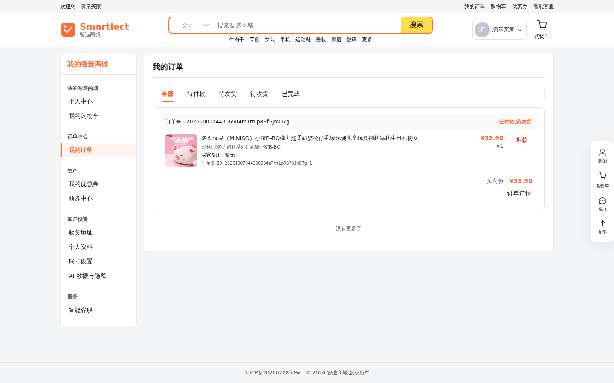
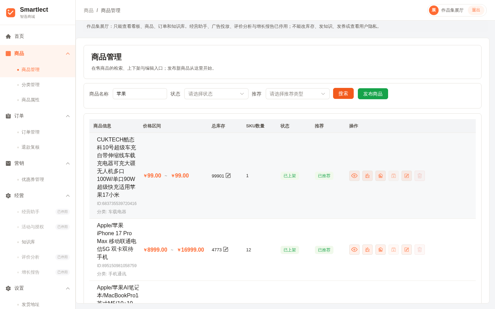
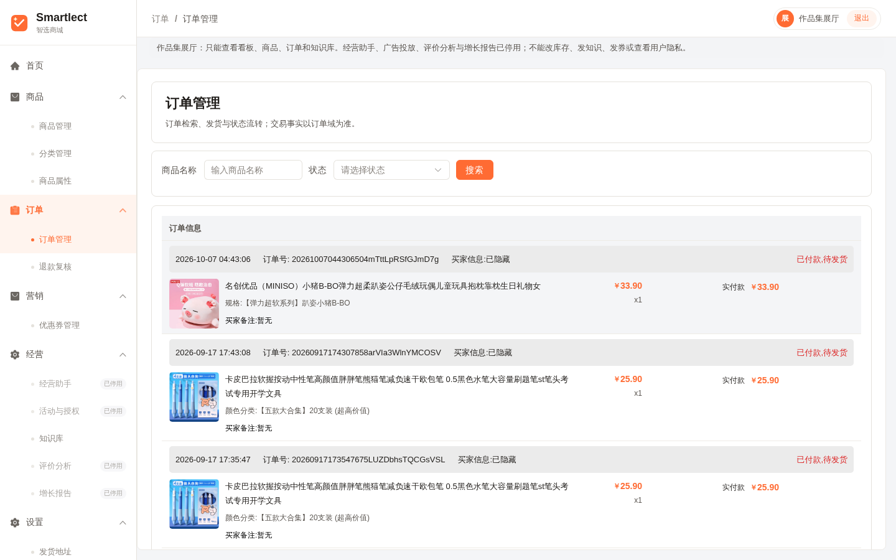
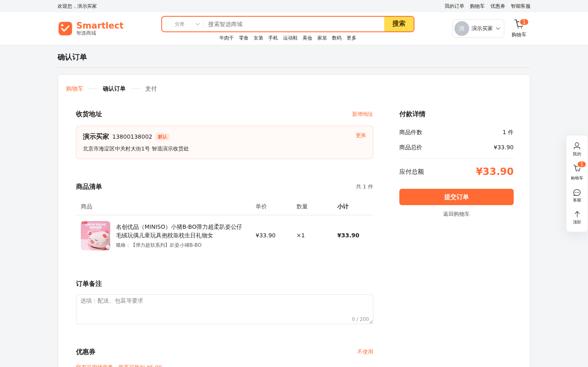
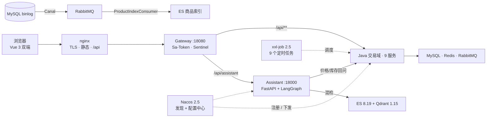

<p align="center">
  
</p>

<h1 align="center">Smartlect</h1>

<p align="center">
  <b>一家会按商品回答的店</b><br/>
  C 端商城 + 商家后台，中间放一个有界 ReAct 导购 Agent
</p>

<p align="center">
  
  
  
  
  
  
  
  <a href="https://github.com/LittleSongxx/Smartlect/actions/workflows/ci.yml"></a>
</p>

<p align="center">
  
</p>

---

**Smartlect 是一套可演示的单店。** 前面是能逛的商城，后面是商家后台，中间不是聊天机器人套了个商城皮——货架、价格、库存来自 Java 目录；导购默认钉在「正在问本商品」；店规写成文档，发布之后才允许被引用。

模型可以建议，不能成交。下单、退款、经营授权都要人点确认。价格和库存不进向量，每次重问交易服务。支付是模拟的，没有真实资金。

线上可以直接点：[用户端](https://smartlect.cn/) · [管理端](https://smartlect.cn/admin/)。

**对外演示账号是公开的，权限在服务端按身份拒绝。** 不要用仓库或环境里的超管。登录页默认填的是可下单的演示买家。

| 端 | 账号 | 密码 | 能做什么 | 不能做什么 |
| --- | --- | --- | --- | --- |
| 用户端 | `shopper@smartlect.demo` | `Visit-Smartlect-2026` | 逛店、问导购、加购、模拟下单（已预置收货地址和体验券） | 改密、改资料、注册新号 |
| 用户端 | `visitor@smartlect.demo` | `Visit-Smartlect-2026` | 逛店、看商品、问导购 | 下单、加购、改密、改地址、注册新号 |
| 管理端 | `gallery` | `Visit-Smartlect-2026` | 看板、商品、订单、退款复核、知识库 | 改库存、发知识、发券、发货、管账号、看用户隐私 |

---

## 逛店的时候在发生什么

<table>
<tr>
<td width="33%" valign="top">

**① 逛店**

首页、分类、搜索、商品详情都是一家真店的皮。货架来自 Java 目录，不是为聊天临时拼的卡片。

搜索走 ES 的 smartcn 分词，索引由 Canal 从 MySQL binlog 增量同步——查询链路不依赖同步链路。

</td>
<td width="33%" valign="top">

**② 问这件**

在商品页打开导购，范围钉在「正在问本商品」。Shopping Agent 按这件检索**已发布**资料；答不上来就承认。

价格和库存不在向量里，每次回问交易服务。

</td>
<td width="33%" valign="top">

**③ 下单**

加购、结算、支付走 Java 交易域：订单幂等账本、库存条件更新、事务性 Outbox 投递事件。

下单和退款都会弹出确认，模型不能替你点。

</td>
</tr>
</table>

<p align="center">
  
  <br/>
  <em>商品页打开导购，浮层标题是「问这件」，默认钉在当前商品；想聊全店政策再点「改问全店」。</em>
</p>

<table>
<tr>
<td width="50%"><br/><b>加购之后</b> — 规格与单价来自商品域，小计随数量实时算</td>
<td width="50%"><br/><b>下单之后</b> — 状态以订单域为准，可继续支付或取消</td>
</tr>
</table>

---

## 导购现场

**回答有出处，敢说不知道。** 店规写成可以单独发布的文档，草稿保存与发布分离；撤回后不再被新的客服引用。每条结论挂着它引用的那一节，点开能对。

**可并行的活派给子智能体。** 遇到对比多件商品这类互相独立的检索，通过 `task_dispatch` 派发 1–3 个子智能体并发跑，各算各的上下文与预算，结果回到主线合成。

**提案要人点确认。** 需要落交易时，Agent 生成的是一张待确认提案，不是直接下单；确认动作始终留在人这一侧。

<table>
<tr>
<td width="50%"><br/><b>带引用的回答</b> — 结论挂到具体文档版本，引用可展开</td>
<td width="50%"><br/><b>规格与库存</b> — 选规格时才向库存服务取数，页面不缓存旧值</td>
</tr>
</table>

---

## 后台看的是同一份数据

管理端不做第二套真相：订单状态以订单域为准，商品上下架改的是商品域，知识库发布的是检索用的那一份。

<table>
<tr>
<td width="50%"><br/><b>商品</b> — 检索、上下架、SKU 与价格区间</td>
<td width="50%"><br/><b>订单</b> — 发货与状态流转，买家信息默认隐藏</td>
</tr>
<tr>
<td width="50%"><br/><b>知识库</b> — 草稿/发布分离，索引失败可重试</td>
<td width="50%"><br/><b>结算</b> — 地址、优惠券、支付方式在提交前一次确认</td>
</tr>
</table>

---

## 架构

<p align="center">
  
</p>

这条边界是刻意画的：浏览器只负责把状态画出来，Python 负责「问什么、检索什么、下一步计划什么」，真正改价格、扣库存、落订单的，只有 Java。

系统里只有一个领域 Agent——Shopping，用有界 ReAct 循环。没有总指挥，没有把检索或记账再包装成 Agent。


```mermaid
flowchart LR
  B["浏览器<br/>Vue 3 双端"] --> N["nginx<br/>TLS · 静态 · /api"]
  N --> G["Gateway :18080<br/>Sa-Token · Sentinel"]
  G -->|/api/assistant| A["Assistant :18000<br/>FastAPI + LangGraph"]
  G -->|/api/**| J["Java 交易域 · 9 服务"]
  A -->|混检| R["ES 8.19 + Qdrant 1.15"]
  A -->|价格/库存回问| J
  J --> D["MySQL · Redis · RabbitMQ"]
  M[("MySQL binlog")] -->|Canal| Q["RabbitMQ"] -->|ProductIndexConsumer| E["ES 商品索引"]
  X["xxl-job 2.5<br/>9 个定时任务"] -.->|调度| J
  C["Nacos 2.5<br/>发现 + 配置中心"] -.->|注册 / 下发| J
  C -.-> A
```

**两条主链路**

| 链路 | 路径 |
|---|---|
| 浏览 | nginx → Gateway（限流/鉴权）→ product → Caffeine L1 → Redis L2 → MySQL；未命中回源，Canal 兜底失效 |
| 导购 | 浏览器 → Assistant 选工具 → ES + Qdrant 混检（只查已发布知识）→ 价格库存回问 Java → 带引用作答或出提案，人点确认才下单 |

**一致性没有用分布式事务框架。** 本地事务 + 事务性 Outbox 投递到 RabbitMQ 做最终一致；订单幂等账本挡住重复提交，库存用条件更新，延迟队列取消超时未付款单，补偿日志自动重放失败的消费者。

---

## 技术栈

| | |
|---|---|
| **前端** | Vue 3 · Vite · Element Plus · TypeScript（用户端）· JavaScript（管理端） |
| **交易** | Java 17 · Spring Boot 3.5 · Spring Cloud 2025 · 9 个服务 · MyBatis + PageHelper |
| **鉴权** | Sa-Token 1.39（网关统一校验 + 服务端 `@SaCheckLogin` / `@SaCheckPermission`） |
| **Agent** | Python 3.11 · FastAPI · LangGraph 1.2 · openai SDK（兼容模式端点白名单） |
| **检索** | Elasticsearch 8.19（smartcn BM25 + 商品索引）· Qdrant 1.15（HNSW dense）→ RRF → gte-rerank |
| **缓存** | Caffeine L1 + Redis L2 + pub/sub 失效 + Canal 兜底 |
| **消息** | RabbitMQ 4.2（Outbox 可靠投递 · 延迟队列 · 秒杀削峰） |
| **变更捕获** | Canal 1.1.8（MySQL binlog → RabbitMQ → ES 商品索引与缓存失效） |
| **调度** | xxl-job 2.5（9 个定时任务：订单超时、支付轮询、Outbox 补偿、秒杀对账等） |
| **服务治理** | Nacos 2.5（服务发现 + 配置中心）· 锁/限流 Redisson 4.0 |
| **模型** | LiteLLM 网关（可选）；演示走 live，缺配置时明确失败 |
| **基础设施** | 9 个容器（MySQL 8.4 · Redis 7.4 · RabbitMQ 4.2 · Nacos 2.5 · ES 8.19 · Qdrant 1.15 · Canal 1.1.8 · xxl-job 2.5 · LiteLLM） |

```
backend/   gateway · user · product · stock · cart · order · pay · coupon · admin
assistant/ Shopping Agent · RAG（ES+Qdrant 混检）· 提案确认 · 子智能体派发
web/       用户端与管理端（Vue 3）
deploy/    容器编排（compose）· nginx · SQL 初始化 · 集群编排
scripts/   dev.sh 入口 · runtime.py 进程编排 · 压测与验证工具
evals/     quality-v2（导购 / 客服）
eval/verification/  评测与发布的原始证据库（按日期归档）
docs/      设计说明与 ADR，给想往下翻的人
```

---

## 快速开始

```bash
./scripts/dev.sh bootstrap     # 探测空闲端口、生成本机凭证（run/runtime.env，权限 600）
./scripts/dev.sh build         # 编译 Java + assistant venv + 双前端
./scripts/dev.sh infra-up      # 起 9 个中间件容器并等待健康
./scripts/dev.sh up            # 按依赖顺序拉起 12 个应用进程
```

用户端 [http://127.0.0.1:18180/](http://127.0.0.1:18180/) ，管理端 [http://127.0.0.1:18181/admin/](http://127.0.0.1:18181/admin/) 。需要一套示例货架时再执行 `./scripts/dev.sh seed-store`。

端口由 bootstrap 探测空闲值并写进 `run/runtime.env`，下表是默认值：

| 层 | 端口 |
|---|---|
| 中间件 | MySQL 13306 · Redis 16379 · RabbitMQ 15672/15674 · Nacos 18848 · ES 9200 · Qdrant 6333 · Canal 11111 · xxl-job 18090 · LiteLLM 14000 |
| 应用 | gateway 18080 · admin 18101 · cart 18102 · pay 18103 · order 18104 · user 18105 · product 18106 · coupon 18107 · stock 18108 · assistant 18000 |
| 前端 | 用户端 18180 · 管理端 18181 |

已经部署的副本：[用户端](https://smartlect.cn/) · [管理端](https://smartlect.cn/admin/)。试用账密见上文，超管密码不在此公开。

边界、评测和运行细节在 [docs/](docs/)： [Agent 设计](docs/agent-design.md) · [quality-v2](docs/quality-eval-v2.md) · [本地运行](docs/runtime.md) · [ADR 索引](#决策记录)。

---

## 怎么验证它真的能跑

仓库带 [CI](https://github.com/LittleSongxx/Smartlect/actions/workflows/ci.yml)。本地一条命令跑三栈自检（Java 单测 · Python 单测 · 双前端 vitest · 运行时自测与进程独立性检查）：

```bash
./scripts/dev.sh check
```

运行时门禁单独也能跑，部署前后各来一次：

```bash
./scripts/dev.sh infra-check    # 中间件健康 + 权限隔离（app/flyway 只能碰自己的库）
./scripts/dev.sh apps-check     # 12 个进程健康 + Nacos 注册数
python3 scripts/xxljob_setup.py # 幂等登记 9 个调度任务（只加注解不会执行）
```

公开评测是 [quality-v2](docs/quality-eval-v2.md) 两条线（导购 / 客服），每条自己的指标和分母，不合成总分。

---

## 运维与排查入口

| 入口 | 在哪 | 用途 |
|---|---|---|
| 站点 | `http://127.0.0.1/` | nginx 反代网关，`/actuator` 与业务端口不对公网开放 |
| 网关健康 | `:18080/actuator/health` | 依赖 Redis / Nacos 的存活探针 |
| 调度中心 | `:18090/xxl-job-admin` | 9 个任务的执行记录、手动触发、失败重试 |
| 配置中心 | `:18848` Nacos 控制台 | `SMARTLECT_GROUP` 下的配置；改完用 `scripts/nacos_config_push.py` 推送 |
| 指标 | 各服务 `/actuator/prometheus` | JVM / Hikari / 线程池；只从内网抓 |
| 应用日志 | `run/logs/<服务>.log` | 启动失败先看这里；`run/logs/<服务>/nacos/` 是注册与配置客户端日志 |
| MQ 补偿 | 各库 `mq_compensation_log` | 消费失败落库后由 `mqCompensationReplay` 自动重放 |
| Outbox 水位 | 各库 `local_message_outbox` | 积压说明投递侧异常；`EXHAUSTED` 需人工介入 |

服务起不来时的顺序：`run/logs/<服务>.log` 找首个异常 → `infra-check` 确认中间件 → `apps-check` 确认注册数 → 调度类问题看 xxl-job 控制台。

---

## 决策记录

架构决策按时间序落档在 [docs/adr/](docs/adr/)，重构期关键决策（2026-10）：

| ADR | 主题 |
|---|---|
| [0006](docs/adr/0006-remove-seata.md) | 移除 Seata，统一为本地事务 + Outbox 最终一致 |
| [0007](docs/adr/0007-hybrid-retrieval-es-qdrant.md) | 检索栈选型 Elasticsearch + Qdrant + RRF |
| [0008](docs/adr/0008-retire-recommendation-line.md) | 推荐 / 归因 / worker 线整体退役 |
| [0009](docs/adr/0009-agent-runtime-choices.md) | Agent runtime 选型（openai SDK · 手写 ReAct 暂缓迁移） |
| [0010](docs/adr/0010-subagent-dispatch.md) | 并行子智能体（SubAgent-as-Tool + create_react_agent） |
| [0011](docs/adr/0011-sa-token-migration-plan.md) | Sa-Token 替换自研鉴权三件套 |
| [0012](docs/adr/0012-echomind-patterns.md) | 借鉴 EchoMind 模式的 Agent 架构清晰化重构 |
| [0013](docs/adr/0013-guard-chain-layering.md) | 守卫链分层治理：意图帧启发式与证据契约校验分离 |

---

## 这个仓库里没有的东西

- **没有真实资金。** 支付是本地模拟：不接第三方、不跳转、不会扣款。
- **没有公开超管密码。** 演示账号权限在服务端裁剪；仓库里的超管凭证只对本地环境有效。
- **没有分布式事务框架。** 一致性靠本地事务 + Outbox + 幂等键，不是 Seata 那类两阶段提交。
- **没有第二个 Agent。** 检索、记账、发货都是确定性服务，不包装成 Agent 增加不确定性。
- **没有把模型当事实源。** 价格、库存、订单状态一律以交易服务为准，模型只负责组织语言与提案。
- **经营助手 / 广告投放 / 评价分析 / 增长报告已退役**，管理端只留菜单占位说明，代码里没有。

---

## 许可

仓库根目录**没有** `LICENSE` 文件。`backend/`、`web/user/`、`web/admin/` 以及 `assistant/licenses/` 下的子模块各自为 **MIT**。
