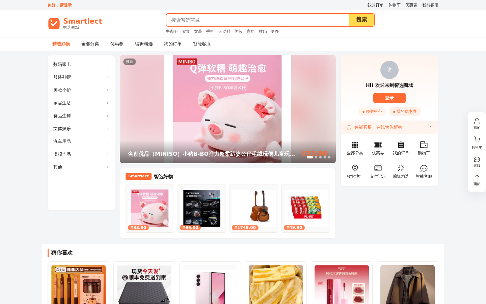
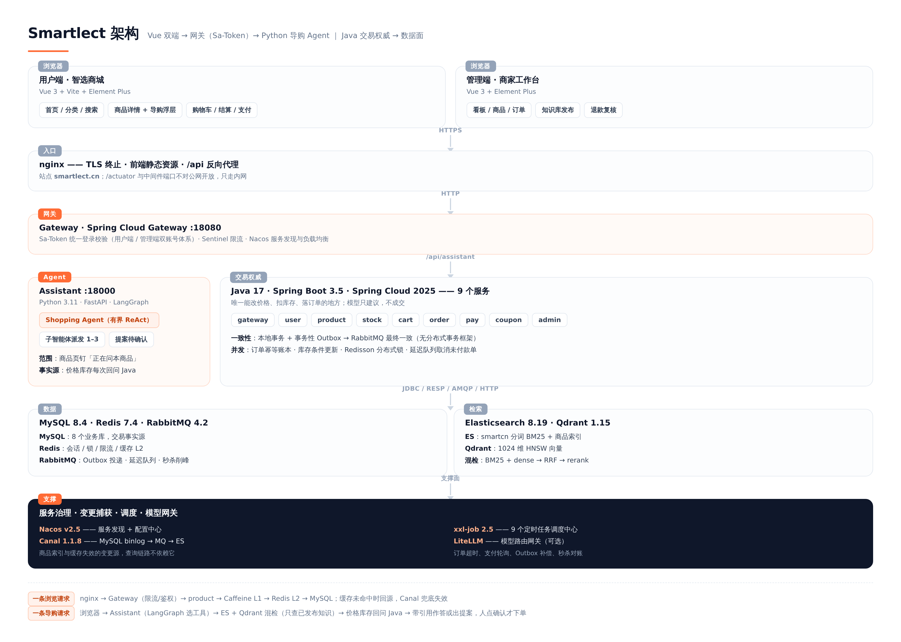
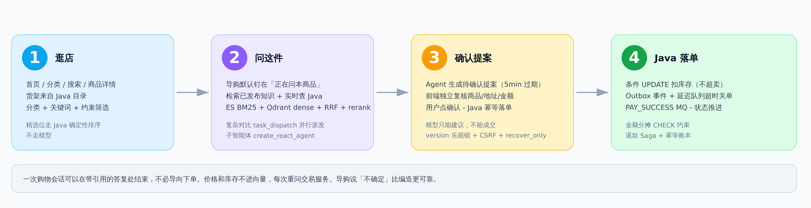
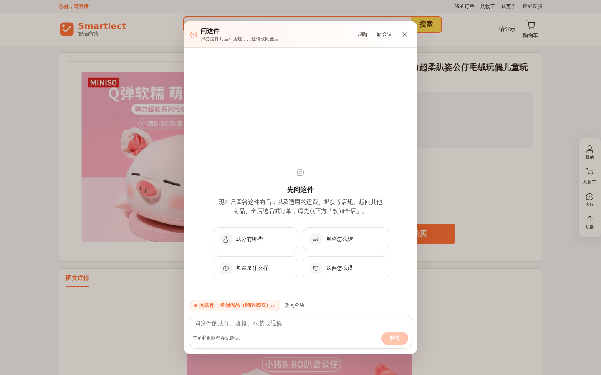
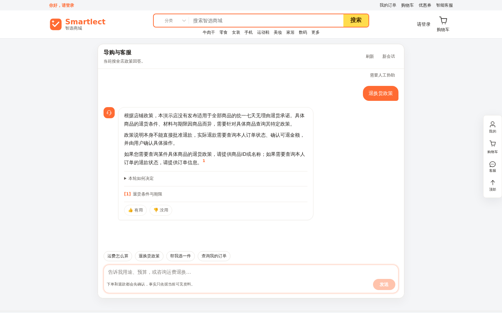
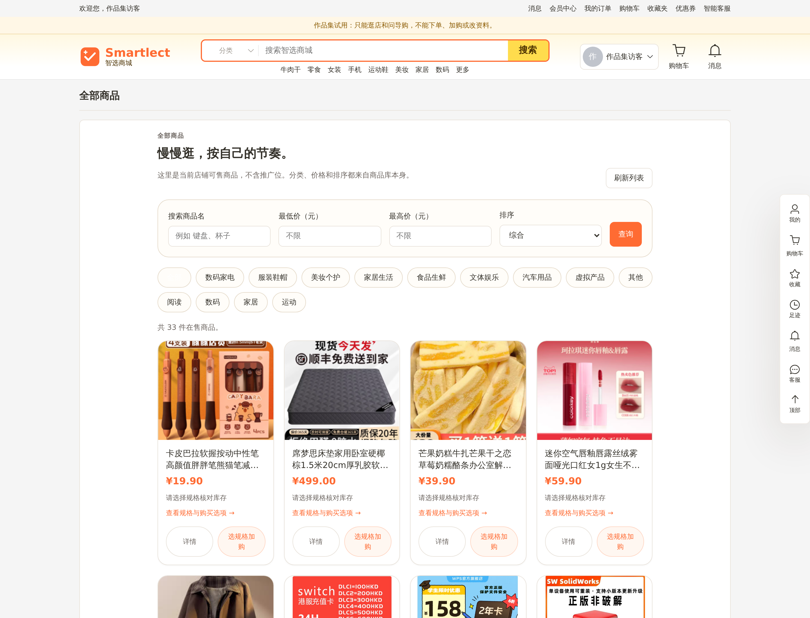
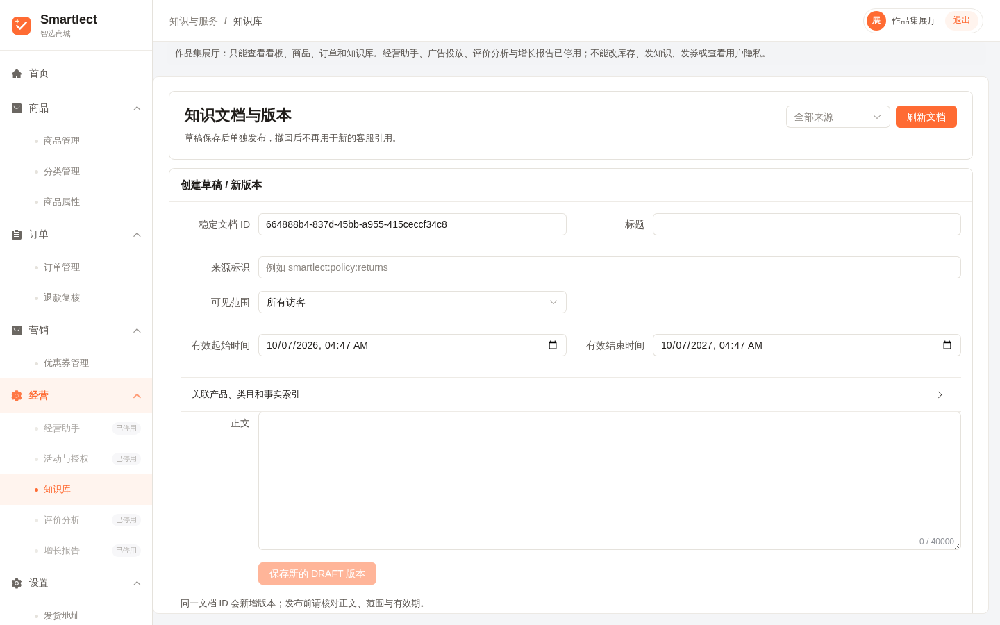
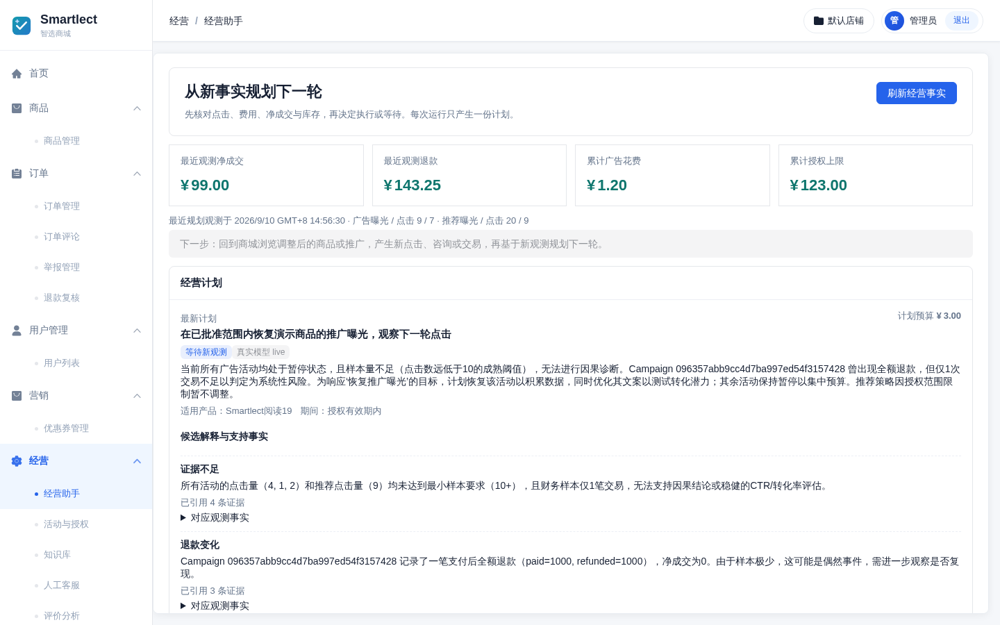

<p align="center">
  
</p>

<h1 align="center">Smartlect</h1>

<p align="center">
  <b>一家会按商品回答的店</b><br/>
  C 端商城 + 商家后台，中间放一个有界 ReAct 导购 Agent
</p>

<p align="center">
  
  
  
  
  
  
  
  <a href="https://github.com/LittleSongxx/Smartlect/actions/workflows/ci.yml"></a>
</p>

<p align="center">
  
</p>

---

**Smartlect 是一套可演示的单店。** 前面是能逛的商城，后面是商家后台，中间不是聊天机器人套了个商城皮——货架、价格、库存来自 Java 目录；导购默认钉在「正在问本商品」；店规写成文档、发布后才被引用。

模型可以建议，不能成交。下单、退款、经营授权都要人点确认。价格和库存不进向量，每次重问交易服务。支付是模拟的，没有真实资金。

线上可以直接点：[用户端](https://smartlect.cn/) · [管理端](https://smartlect.cn/admin/)。

**对外演示账号是公开的，权限在服务端按身份拒绝。** 不要用仓库或环境里的超管。登录页默认填的是可下单的演示买家。

| 端 | 账号 | 密码 | 能做什么 | 不能做什么 |
| --- | --- | --- | --- | --- |
| 用户端 | `shopper@smartlect.demo` | `Visit-Smartlect-2026` | 逛店、问导购、加购、模拟下单（已预置收货地址和体验券） | 改密、改资料、注册新号 |
| 用户端 | `visitor@smartlect.demo` | `Visit-Smartlect-2026` | 逛店、看商品、问导购 | 下单、加购、改密、改地址、注册新号 |
| 管理端 | `gallery` | `Visit-Smartlect-2026` | 看看板、商品、订单、知识库 | 改库存、发知识、发券、发货、管账号、看用户隐私 |

---

## 架构

这条边界是刻意画的：浏览器只负责把状态画出来，Python 负责「问什么、检索什么、下一步计划什么」，真正改价格、扣库存、落订单的，只有 Java。

<p align="center">
  
</p>

系统里只有一个领域 Agent——Shopping，用有界 ReAct 循环。没有总指挥，没有把检索或记账再包装成 Agent。

- **Shopping Agent** 看这一轮的问题，选工具，读回执，再决定澄清、作答，或生成一张待确认提案。遇到可并行的独立检索任务（如对比多件商品），通过 `task_dispatch` 工具派发 1–3 个子智能体并发执行，各算各的上下文与预算。
- **RAG** 是确定性服务。知识要先发布才进检索（ES BM25 + Qdrant dense → RRF → rerank）；首页精选位走 Java 目录的确定性排序，不走模型。
- **鉴权** 统一走 [Sa-Token](docs/adr/0011-sa-token-migration-plan.md)：用户端与管理端双账号体系，网关统一校验、服务端注解鉴权。

<p align="center">
  
</p>

一次购物会话可以在带引用的答复处结束，不必导向下单。

---

## 店里在发生什么

<table>
<tr>
<td width="33%" valign="top">

**① 逛店**

首页、分类、搜索、商品详情都是一家真店的皮。货架来自 Java 目录，不是为聊天临时拼的卡片。

</td>
<td width="33%" valign="top">

**② 问这件**

在商品页打开导购，范围钉在「正在问本商品」。Shopping Agent 按这件检索已发布资料；答不上来就承认。

</td>
<td width="33%" valign="top">

**③ 管店**

后台维护店规和商品资料。经营助手、广告投放、评价分析和增长报告已从代码中移除，菜单仅留占位说明。

</td>
</tr>
</table>

<p align="center">
  
  <br/>
  <em>商品页打开导购，浮层标题是「问这件」，默认钉在当前商品。规格对照和店规问答都绑在这一件上。</em>
</p>

---

## 能力地图

<table>
<tr>
<td width="50%"><br/><b>逛店</b> — 首页就是货架，不是 Agent 控制台套了个商城皮</td>
<td width="50%"><br/><b>问这件</b> — 浮层默认钉在当前商品，而不是整站闲聊</td>
</tr>
<tr>
<td width="50%"><br/><b>独立导购</b> — 不在商品页时按全店政策聊运费、退换和选品</td>
<td width="50%"><br/><b>货架</b> — 分类和搜索走同一套在售目录，价格库存来自 Java</td>
</tr>
<tr>
<td width="50%"><br/><b>知识库</b> — 店规写成可发布的文档；撤回后不再被新的客服引用</td>
<td width="50%"><br/><b>已移除</b> — 经营助手、广告投放、评价分析、增长报告只保留菜单说明占位</td>
</tr>
</table>

---

## 技术栈

| | |
|---|---|
| **前端** | Vue 3 · Vite · Element Plus · TypeScript（用户端）· JavaScript（管理端） |
| **交易** | Java 17 · Spring Boot 3.5 · Spring Cloud 2025 · 9 个服务 · MyBatis + PageHelper |
| **鉴权** | Sa-Token 1.39（网关统一校验 + 服务端 `@SaCheckLogin` / `@SaCheckPermission`） |
| **Agent** | Python 3.11 · FastAPI · LangGraph 1.2 · openai SDK（兼容模式端点白名单） |
| **检索** | Elasticsearch 8.19（smartcn BM25）+ Qdrant 1.15（HNSW dense）→ RRF → gte-rerank |
| **锁/限流** | Redisson 4.0（RLock 分布式锁 · RRateLimiter 限流） |
| **存储** | MySQL · Redis · RabbitMQ · Nacos · PostgreSQL（LangGraph checkpointer） |
| **模型** | 独立配置；演示走 live，缺配置时明确失败 |

```
backend/   gateway · user · product · stock · cart · order · pay · coupon · admin
assistant/ Shopping Agent · RAG（ES+Qdrant 混检）· 提案确认 · 子智能体派发
web/       用户端与管理端（Vue 3）
evals/     quality-v2（导购 / 客服）
docs/      设计说明与 ADR，给想往下翻的人
```

---

## 快速开始

本地看演示：

```bash
./scripts/dev.sh bootstrap
./scripts/dev.sh build
./scripts/dev.sh infra-up
./scripts/dev.sh up
```

用户端 [http://127.0.0.1:18180/](http://127.0.0.1:18180/) ，管理端 [http://127.0.0.1:18181/admin/](http://127.0.0.1:18181/admin/) 。需要一套示例货架时再执行 `./scripts/dev.sh seed-store`。

已经部署的副本：[用户端](https://smartlect.cn/) · [管理端](https://smartlect.cn/admin/)。试用账密见上文，超管密码不在此公开。

边界、评测和运行细节在 [docs/](docs/)： [Agent 设计](docs/agent-design.md) · [quality-v2](docs/quality-eval-v2.md) · [本地运行](docs/runtime.md) · [ADR 索引](#决策记录)。

## 质量

仓库带 [CI](https://github.com/LittleSongxx/Smartlect/actions/workflows/ci.yml)。公开评测是 [quality-v2](docs/quality-eval-v2.md) 两条线（导购 / 客服），每条自己的指标和分母，不合成总分。

```bash
./scripts/dev.sh check
```

---

## 决策记录

架构决策按时间序落档在 [docs/adr/](docs/adr/)，重构期关键决策（2026-10）：

| ADR | 主题 |
|---|---|
| [0006](docs/adr/0006-remove-seata.md) | 移除 Seata，统一为本地事务 + Outbox 最终一致 |
| [0007](docs/adr/0007-hybrid-retrieval-es-qdrant.md) | 检索栈选型 Elasticsearch + Qdrant + RRF |
| [0008](docs/adr/0008-retire-recommendation-line.md) | 推荐 / 归因 / worker 线整体退役 |
| [0009](docs/adr/0009-agent-runtime-choices.md) | Agent runtime 选型（openai SDK · 手写 ReAct 暂缓迁移） |
| [0010](docs/adr/0010-subagent-dispatch.md) | 并行子智能体（SubAgent-as-Tool + create_react_agent） |
| [0011](docs/adr/0011-sa-token-migration-plan.md) | Sa-Token 替换自研鉴权三件套 |

---

## 许可

仓库根目录**没有** `LICENSE` 文件。`backend/`、`web/user/`、`web/admin/` 以及 `assistant/licenses/` 下的子模块各自为 **MIT**。
