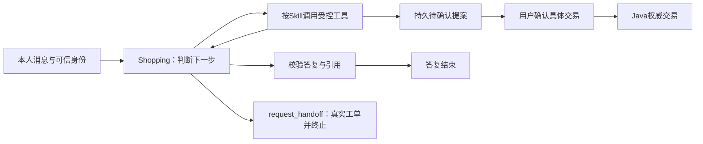

# Smartlect Agent 设计与验证边界

系统保留两个领域 Agent：Shopping 服务用户，Merchant 服务商家；单项任务由一个 Agent 完成。
当前功能、失败和验收进度以 [IMPLEMENTATION_STATUS](../IMPLEMENTATION_STATUS.md) 为准。
F4/F5功能证据已有记录；F6完整评测和F7交付仍在进行，本文描述实现，不代替通过证明。

开发集用于定位共享职责和数据边界问题，不按失败问题的措辞添加专用路由或答案规则。
现有 answer 编译表（混合工具批次、商品焦点、试用只读）是共享控制面，不是按题加规则；新失败仍应并入这张表，而不是再开一条题面闸门。
先验证同类输入、相反意图及状态边界，再冻结协议做真实模型复验；历史失败不覆盖，留出集不参与修复。
服务器绑定事实与模型理解分开评分，工具合同通过不等于语义正确，也不要求模型每轮采取经营动作。

## Shopping：有界 ReAct

[Shopping 图](../growth/src/smartlect/agents/shopping.py) 在 `model → tools → model` 间依据观测继续，
用 `answer` 校验终答。图节点不是不同 Agent。先读取可信主体、本人的最近8轮与有来源范围的摘要。
Shopping 开场只有目录工具（`load_skill` / `search_knowledge` / 记忆 / `request_handoff`）。业务工具由 `load_skill` 按已审核 Skill 并入本轮；管理端热改只能再缩小已加载 Skill 的 `tools`。Merchant 仍按阶段加载所需 Skill。可用工具始终与该主体权限取交集。
访客只能读可见资料及转交本人会话，不能操作交易；历史答复、偏好和检索内容都不能替代新的Java价格、库存与交易状态。

| Skill | 作用 |
|---|---|
| shopping_advice | 澄清用途/预算、真实SKU、本人地址、偏好和下单提案 |
| support_policy | 本轮检索已发布政策、引用、缺口/冲突处理；客服可以独立结束 |
| order_service | 本人订单与付款/退款状态、待确认取消/退款；没有付款执行工具 |

版本化 Skill 在 [skills目录](../growth/src/smartlect/skills/)，随安装包发布；聊天、文档和商品描述不能安装或修改它们。
管理端「AI 资产 · 提示词与技能」可以在**不换 skill_id、不改结构**的前提下热改 `instructions` 等文本
（`prompt_template` 表，激活/回滚单行原子切换，代码文本是冻结回退）；`tools` 只能取打包集合的子集，
因为 Agent 的可调用工具集正是由这些名字拼出来的（见 [ADR 0005](adr/0005-ai-asset-ops-surface.md)）。
模型通过原生 `finish_answer` 输出函数提交 `FinalAnswer`，该函数是控制器的输出通道，没有业务副作用。
模型声明 `request_kind` 与 `handoff_requested`；`answer_status` 与是否建单由控制器按声明 × 本轮证据编译，见 [ADR 0002](adr/0002-decision-compile.md)。复合转交不必把转交挤进 `request_kind`。
Shopping 请求设置 `tool_choice=required`；模型仍自行选择先调用哪个允许的工具或提交终答。
终答必须单独提交，混合终答与业务工具的一批请求会在执行前被拒绝。
兼容的JSON正文仍经过相同校验；非法引用、虚构卡片和缺少事实的实质答复不能直接发布。
这类结构校验不能代替逐句事实支持率评测。

转人工使用一等工具`request_handoff`，可附本轮政策说明与真实引用，收到工单回执即终止。
普通回答与业务转交分开，避免仅凭正文或额外状态字段暗示已经办理；不使用转人工短语词表。
控制器安全升级、模型选择工具和恢复已有工单分别记录来源。工具与回答之间崩溃时保留工单，
停止自动续跑；没有工具回执的恢复不能算模型成功完成转交。详见[工具合同](contracts.md)。

商品级介绍仅显示必要字段，聚合库存及未知的SKU库存不作为可售依据；SKU卡来自共用推荐服务。
指定商品使用 `product_id` 缩小服务端授权范围，不把ID当名称中的必备词。
工具完整回执仍持久保存；模型只接收完成当前任务所需的观测，减少重复字段占用。

每次实际模型attempt在发出前持久计数。原运行deadline、已耗调用及终答修复数跨恢复保留。

| 限制 | 实现 |
|---|---|
| 模型 | 每轮最多6次实际请求，含embedding、重试、重排与格式修复 |
| 单次请求 | 最多2次attempt；每次25秒总超时；共享2个模型并发槽 |
| 工具/检索 | 最多10个接纳工具调用、2次检索；普通工具15秒，知识/推荐30秒 |
| 运行 | 原90秒deadline，图使用剩余时间至多85秒并留收尾时间；另有25节点步上限 |
| 终答修复 | 最多一次，仍计原模型/工具预算 |
| 上下文 | UTF-8字节数加消息开销不超过12,000，作为保守token上界，非供应商精确分词 |
| 观测 | 单工具至多6,500字节；检索保留完整片段，超大普通结果返回可解析错误 |

上下文裁剪移除完整旧轮次，保留当前问题以及工具调用/结果配对。上下文超限会明确降级，不能自动扩大限制。
真实模型默认qwen3.7-plus；无总模型费用封顶，但不提升循环/重试额度，不自动升级其他模型。
实际供应商模型、prompt/Skill/schema、usage、失败和估算价格版本逐attempt记录，未知值为null。

## RAG、记忆与人工客服

知识工具先按scope、ACL、发布状态和有效期筛选，再执行两段排序：
第一段是中文BM25与稠密检索各取Top20、RRF合并至12；第二段精排按查询词覆盖率与最小覆盖窗口紧密度打分，取最终8条。
两段问的不是同一件事——第一段已经用过词频与长度，精排看的是覆盖整个问题还是只重复一个词，
所以只堆一个词的片段会输给真正讨论该问题的片段。两段排名都记进 `retrieval`，
一次答错可以据此区分召回没进候选和进了候选但排序输掉；长问题里的单一词命中降权保留而不丢弃，
否则唯一被冷门词命中的片段进不了精排就已消失。当前基础语料32份，模型至多见4个完整引用片段；
小规模授权检索上限5,000片段。开发集24例上精排把recall@4从0.917提到0.958，recall@8不变
（`artifacts/retrieval-rerank-attribution-v1.json`，语料仅32片段，不能外推到大索引）。
同义词表只做词形归一（口语、错别字），不含意图映射：要求人工是 `request_handoff` 动作，不是文档查询。
embedding故障可退到词法并记录原因，不能生成假向量。资料保存版本、校验和、来源和切片位置。
受限Markdown、TXT和有文本层PDF解析只产生草稿，明确发布后才进入当前检索。

模型看到的 `evidence_status=retrieved` 只表示候选命中。资料未发布某项承诺意味着所问保证未知，
不能推为服务不存在。已发布否定可以结束；合法空集说明不足且不建单。例外、冲突、隔离注入、
明示转交以及要办未发布服务才转人工并建单。不能仅在文字中建议找人。
历史对话仅帮助理解指代；政策答复需要本轮新检索，最终引用再次核对当前可见性。
发现改变规则/绕过确认的可疑指令时终止该知识回答，不执行指令，不把危险原文当有效答复。

| 记忆层 | 权威与边界 |
|---|---|
| 短期会话 | 本人/scope隔离；摘要记录版本与覆盖消息，不能编造交易结论 |
| 上下文压缩 | 有意保持抽取式：完整保留最近8轮，更早只逐字引用用户原话（≤1400 token）。放不下的更早请求在 `summary.dropped` 记条数与sequence区间，一条都放不下时同样上报，提示中要求向用户确认而不是当作没发生。不做模型摘要：耐久约束在 `user_preference` 里带原话可核对，交易事实来自Java，模型改写只会复述已可核对的数据并多一条漂移路径 |
| 用户偏好 | 显式值优先；推断需引用当前原话，默认30天；删除墓碑阻止推断复活 |
| 程序性Skill | Git版本化，文档与聊天不可覆盖 |
| 经营经验 | 同商家/scope的DRAFT经验须人工审阅批准，只有APPROVED正文进入后续规划 |

[MemoryStore.finish_answer](../growth/src/smartlect/memory.py) 同事务提交最终消息、SSE事件和run终态，
同时复核租约、owner、人工接管及引用。接管/清理撤销租约并推进fencing，旧模型或工具响应不能晚写。
客服详情通过工单归属与指派权限读取历史消息、引用和当前提案；人工可回复/结束工单，无代确认交易按钮。
自动客服可以提交自己刚创建的OPEN工单通知，但不能抢回TAKEN_OVER会话。详见[客服合同](support-contract.md)。
SSE回放已落库事件与最终正文；当前没有把供应商逐token流直接透传给用户。首个进度事件不算用户首字。

## 推荐与交易：确定性服务

首页 [`GET /recommendations`](../growth/src/smartlect/app.py) 仍走 [RecommendationService](../growth/src/smartlect/recommendation/service.py)
五路召回（内容/类目/已付款共购/付款热门/新品），`algorithm_version` 为排序器内容哈希。
可售门 [`eligible_skus`](../growth/src/smartlect/catalog_gate.py) 与广告投放共用；`rank_skus` 权重和广告相关性不变。
这不是第三个 Agent。每路 SQL 在 LIMIT 前应用服务端 scope 及请求的缩小筛选。Java 快照和逐 SKU 库存决定可售、价格与硬约束。
规则贡献和理由可检查；付款热度是已确认付款件数，包含后续退款，不称净销量，未知值保持 null。

Shopping 的 `recommend_skus` / `search_skus` / `compare_skus` 不再调用首页五路服务，
只走 [ShoppingRetrieve](../growth/src/smartlect/shopping_retrieve.py)：会话任务槽合并后打 `searchOnSale`，
再过同一可售门。有硬约束时禁止 popular / copurchase 补位；落空返回合法空集
`empty_reason=hard_constraint_unsatisfied`。比较 2–4 个目标缺一个只标 `comparison_complete=false`，
不补无关热销。长期 `user_preference` 只作排序软信号，不自动变成硬排除。
回执仍写 [`save_recommendation`](../growth/src/smartlect/attribution.py)，卡片继续带 `recommendation_id` /
`position`；策略版本为 `shopping-constraint-v1`，不读 `StrategyStore`。商家 `set_recommendation_policy` 因此不再改导购。

最多12个合法SKU可接受一次有界语义重排，只能返回同集合完整排列；随后重新查询这些SKU的Java状态，
剔除售罄/涨价越界者，不再次召回补位。规则、内容规则、真实语义及语义失败回退分别记录ranking_mode。
服务端持久分桶与历史receipt不变；授权推荐动作可CAS切换单组或两组，`all`必须获得明确授权，不能由两项单组权限推导。
曝光/点击来自实际用户互动，不从列表生成或模型回答虚构。

[Tool Registry](../growth/src/smartlect/tools.py) 集中处理严格参数、权限、超时、工具种类及回执。
模型只能生成提案；确定性确认入口验证当前用户、CSRF、原提案、有效期和具体Java报价。
用户下单确认和模拟付款是两项独立确认；退款绑定本人明细与剩余可退全额。查询成功/受理不等于Java业务完成。
UNKNOWN先查原操作回执，不能换幂等键重发。价格、库存、订单、支付、退款唯一权威为Java，Python不直改交易表。

Java冻结可信触点上下文；广告7天与同SKU推荐24小时独立归因，退款继承原付款来源。
无可信来源为UNKNOWN，不并入自然；两个归因维度不能相加成两份收入。详见[合同](contracts.md)。

## Merchant：规划、执行、等待与新观测重规划

[Merchant Agent](../growth/src/smartlect/agents/merchant.py)、[控制器](../growth/src/smartlect/merchant/service.py)
和[持久观测/计划](../growth/src/smartlect/merchant/store.py) 形成一个领域任务。
固定阶段读取已提交的曝光、收费点击、Java付款/退款/DECLINED尝试和库存，`plan → validate`产生有限计划；
确定性授权/动作执行器执行后结束本次模型运行，等待真正新观测。
自己的成功参数修改、时间刷新或库存查询generation不单独算新效果；无新观测不新增模型运行。

模型看到事实及精确证据ID、当前筛查和允许/阻断动作。低CTR筛查不证明因果或收入提升。
`campaign_plan`、`performance_review`、`creative_copy`由固定阶段按需加载，不构成额外Agent。
每轮至多4次实际模型attempt、一次计划修复、8动作、原90秒deadline；上下文最多36,000 UTF-8字节，
这是约12k-token目标的粗估，不能宣称精确分词上限。候选计划解释可审查，隐藏思考不保存。

商家首次明确批准不可变grant与计划快照；同scope账户跨plan/run/round累计预算。
后续计划只在原目标、商品、动作、金额、有效期及策略范围内自动执行，越界整体待重新批准。
重新审批导致的保护暂停版本转换固定在grant快照，原spec不变，不能读取新版本绕过CAS。
多批计划可能部分成功；先按原action ID恢复已提交/未知回执，再允许新计划。
安全无动作有明确回执，不能称为实际优化；新流量必须读取真实当前策略/素材/库存。

支付失败只来自Java持久的PAYMENT_ATTEMPT/DECLINED，当前模拟拒付不发生金融副作用。
取消、未付款、超时和UNKNOWN均不能充当失败事实。已确认拒付也不能被模型凭空解释为取消或技术故障。
经营经验原DRAFT与人工修订APPROVED正文分存，加载记录具体id/version；装载正确不代表语义应用正确。
完整动作、授权及恢复边界见[经营合同](merchant-contract.md)与[投放合同](ads-contract.md)。

## 证据和未完成范围

真实模型、规则回退、mock及注入transport分别标记；用过真实模型不等于最终答复为live。
F2/F3最小纵切、F4投放、F5经营的实际成功与失败在实施状态中保留，不能替代F6当前版本评测。
F6按冻结合同评测32个RAG开发问题、最终冻结后的12个holdout、20工具任务、五经营病例和四分支三种子。
未审查语义、未触发故障、未执行或主线失败均不能当通过；允许无收益或负收益。

没有总Supervisor，也没有把检索、推荐、广告库存保护、归因或Java交易包装为Agent。
认知面 / 控制面 / 数据面的分层与只读 `decision`/`checks` 快照见 [ADR 0003](adr/0003-agent-control-plane.md)。
MCP是可能的工具适配边界，首版运行不依赖MCP服务。该选择和AI辅助开发/人工责任边界见
[ADR](adr/0001-final-integration.md)、[完整规格](../HANDOFF.md)及[验收矩阵](f6-f7-gate-map.md)。
