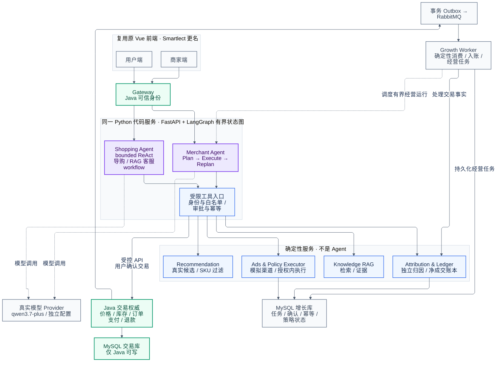

# Smartlect 最终目标架构

这是待实施的改造目标，不是现有功能完成证明。紫色仅表示两个业务 Agent：用户会话采用 Shopping Agent 的 bounded ReAct；经营任务采用 Merchant Agent 的 Plan → Execute → Replan。两者通过领域事件和持久化任务协同，无 LLM 总 Supervisor、Agent Team 或去中心化协商。

Vue 用户端、商家端复用原前端后更名。蓝色节点是同一 Python 工程中的确定性服务与受限工具，Growth Worker 是确定性消费者与运行调度器，提交持久化经营任务后调度 Merchant Agent 的有界图；RAG、库存、计费、创意生成函数、执行器和监控均不另算 Agent。Knowledge RAG 仅返回检索证据，由 Shopping Agent 的 grounded final-answer 节点生成带引用答案或转人工，不增加第二个回答模型。只有 Java 能写交易库，Python 只能调用受控 Java API。真实模型目标为 qwen3.7-plus，模型配置独立；广告和支付仍为模拟渠道。

FastAPI + LangGraph 使用有界状态图。跨用户确认或商家审批时返回 WAIT；任务、确认、授权和幂等状态由 MySQL 增长库中的领域状态机持久化，恢复不依赖内存 checkpointer。商家初次批准计划和独立、不可变的 grant envelope；新计划版本在同一授权范围内可复用 grant。累计花费与预留预算不会因 plan_version、agent_run_id 或 round_id 变化而清零，超出范围、有效期或累计预算时必须重新批准。图省略普通配置和部分状态读写箭头；增长库与交易库使用独立账号和权限。



## 渲染与严格检查

2026-09-09，Mermaid CLI 11.17.0 + 本机 Chrome，真实渲染退出码 0；随后使用 view_image 检查 PNG。

- [x] 文件：原始 Mermaid 有效，Markdown 使用 mermaid 围栏；两份代码逐字一致。
- [x] 箭头：前端 → 可信身份 → 两 Agent → 受限工具正确；Java → Outbox/RabbitMQ → Worker → 账本/任务，以及 Worker 虚线调度 Merchant Agent 的方向正确；未画 Python 写交易库。
- [x] 内容：16 个节点，两个业务 Agent、四类确定性服务、交易权威、数据库隔离及模型配置齐全。
- [x] 完整性：两 Agent 均经过受限工具；任务、确认与幂等持久性在正文明确，不暗示内存可跨请求恢复。
- [x] 视觉：白底与三类克制颜色、标签完整、箭头不穿过节点、主数据流清晰；长服务连线是概览图保留的布局取舍。

初版发现中文 HTML 标签裁切与事件连线穿节点；关闭 HTML labels 并改用 ELK 后复查消除。评分 **9/10，ACCEPT**。

可复现命令（项目根，需可用 Chrome / Chromium）：

```bash
mmdc -i figures/smartlect-final-architecture.mmd -o figures/smartlect-final-architecture.png -b white -w 2400 -s 1.5
```

本机实际使用 Windows Node 调用 mmdc 的 src/cli.js，并通过临时 Puppeteer 配置选择本机 Chrome；没有启动或改变业务实例。
