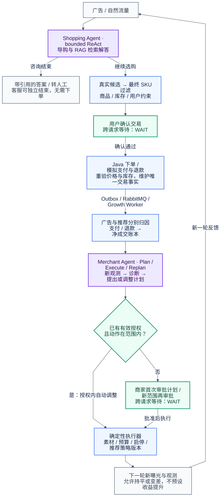

# Smartlect 最终目标业务闭环

这是待实施的目标流程。紫色只有 Shopping Agent 和 Merchant Agent；蓝色为确定性业务步骤，绿色表示用户确认或商家授权边界。一次购物会话是有界 ReAct，一次经营任务是单 Merchant Agent 的 Plan-and-Execute，并基于新观测 Replan。

RAG 客服作为 Shopping Agent 的检索 workflow：Knowledge RAG 返回检索证据，Shopping Agent 的 grounded final-answer 节点生成带引用答案或转人工，不增加独立 RAG 回答模型。进入购买路径时，系统先用实际候选和最终 SKU 过滤，再等待用户确认；Java 在下单时重新校验交易事实。广告与推荐分别归因，支付和退款进入净成交账本。

商家首次审批具体计划版本及独立、不可变的 grant envelope。后续新计划版本在同一 envelope 内可沿用该 grant 自动调整，无需每次重新审批；改变授权范围、目标、有效期或超出累计预算须再审批。花费与预算预留跨计划版本累计，不因 plan_version、agent_run_id 或 round_id 变化清零。执行器在实际操作前复核权限、范围、预算、库存和幂等键。跨确认返回 WAIT，持久状态落 MySQL；取消、拒绝或过期不会执行。广告和支付为模拟渠道，下一轮只使用执行后产生的新观测，不预置提升。



## 渲染与严格检查

2026-09-09，Mermaid CLI 11.17.0 + 本机 Chrome，真实渲染退出码 0；随后使用 view_image 检查 PNG。

- [x] 文件：原始 Mermaid 有效，Markdown 使用 mermaid 围栏；两份代码逐字一致。
- [x] 箭头：选购、客服独立结束、确认交易、事件入账、授权分支与新曝光反馈方向正确。
- [x] 内容：12 个节点，用户确认与商家审批的 WAIT、广告/推荐独立归因、净成交、授权内自动调整齐全。
- [x] 完整性：RAG 不强制导向下单；商家新范围再审批；反馈不承诺收益上升。
- [x] 视觉：正文和 WAIT 完整显示；无节点遮挡或交叉误导，纵向流程可按阅读顺序检查。

初版 HTML 标签存在尾字裁切；关闭 HTML labels 后复查消除。评分 **9/10，ACCEPT**；纵向版式适合交接文档滚动阅读。

可复现命令（项目根，需可用 Chrome / Chromium）：

```bash
mmdc -i figures/smartlect-final-journey.mmd -o figures/smartlect-final-journey.png -b white -w 2400 -s 1.5
```

本机实际使用 Windows Node 调用 mmdc 的 src/cli.js，并通过临时 Puppeteer 配置选择本机 Chrome；没有启动或改变业务实例。
